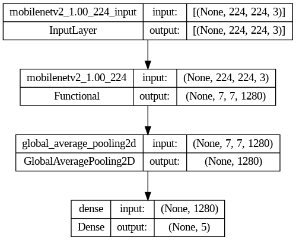
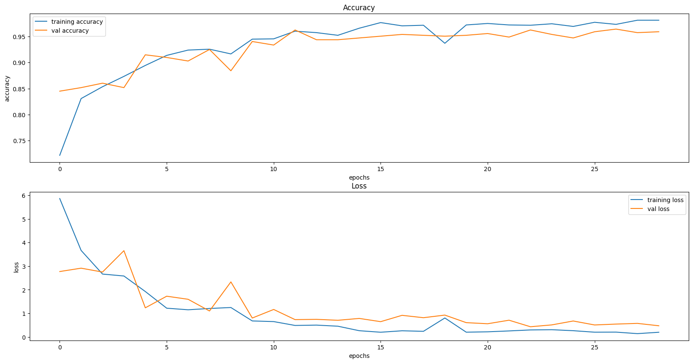

<div style="position: absolute; top: 0; right: 0;">
    <a href="ertugrulbusiness@gmail.com"></a>
    <a href="https://tr.linkedin.com/in/ertu%C4%9Fruldemir?original_referer=https%3A%2F%2Fwww.google.com%2F"></a>
    <a href="https://github.com/ertugruldmr"></a>
    <a href="https://www.kaggle.com/erturuldemir"></a>
    <a href="https://huggingface.co/ErtugrulDemir"></a>
    <a href="https://stackoverflow.com/users/21569249/ertu%c4%9frul-demir?tab=profile"></a>
    <a href="https://medium.com/@ertugrulbusiness"></a>
    <a href="https://www.youtube.com/channel/UCB0_UTu-zbIsoRBHgpsrlsA"></a>
</div>

# Flower Image Classification
 
## __Table Of Content__
- (A) [__Brief__](#brief)
  - [__Project__](#project)
  - [__Data__](#data)
  - [__Demo__](#demo) -> [Live Demo](https://ertugruldemir-flowerimageclassification.hf.space)
  - [__Study__](#problemgoal-and-solving-approach) -> [Colab](https://colab.research.google.com/drive/16jVloFQgVrTmysMuxEX5aj7GLdp0ucoI)
  - [__Results__](#results)
- (B) [__Detailed__](#Details)
  - [__Abstract__](#abstract)
  - [__Explanation of the study__](#explanation-of-the-study)
    - [__(A) Dependencies__](#a-dependencies)
    - [__(B) Dataset__](#b-dataset)
    - [__(C) Modelling__](#e-modelling)
    - [__(D) Deployment as web demo app__](#g-deployment-as-web-demo-app)
  - [__Licance__](#license)
  - [__Connection Links__](#connection-links)

## __Brief__ 

### __Project__ 
- This is an __image classification__ project that uses the  [__tf_flowers__](https://www.tensorflow.org/datasets/catalog/tf_flowers) to __classify the flower images__ into corresponding specie .
- The __goal__ is build a deep learning image classification model that accurately __classifying the images__ into corresponding flower specie class based on the features. 
- The performance of the model is evaluated using several __metrics__ loss and accuracy metrics.

#### __Overview__
- This project involves building a deep learning model to classfy the images. The dataset contains 3670 images with 5 classes.Split distributions are 0.6 train, 0.2 validation and 0.2 test. The models selected according to model tuning results, the progress optimized respectively the previous tune results. The project uses Python and several popular libraries such as Pandas, NumPy, tensorflow.

#### __Demo__

<div align="left">
  <table>
    <tr>
    <td>
        <a target="_blank" href="https://ertugruldemir-flowerimageclassification.hf.space" height="30">[Demo app] HF Space</a>
      </td>
      <td>
        <a target="_blank" href="https://colab.research.google.com/drive/1zU65I9DNoiZz0rWKJNXndbMI2cYMWpMy">[Demo app] Run in Colab</a>
      </td>
      <td>
        <a target="_blank" href="https://github.com/ertugruldmr/FlowerImageClassification/blob/main/study.ipynb">[Traning pipeline] source on GitHub</a>
      </td>
    <td>
        <a target="_blank" href="https://colab.research.google.com/drive/16jVloFQgVrTmysMuxEX5aj7GLdp0ucoI">[Traning pipeline] Run in Colab</a>
      </td>
    </tr>
  </table>
</div>


- Description
    - __classify the flower images__ into  flower species.
    - __Usage__: Set the feature values through sliding the radio buttons then use the button to predict.
- Embedded [Demo](https://ertugruldemir-flowerimageclassification.hf.space) window from HuggingFace Space
    

<iframe
	src="https://ertugruldemir-flowerimageclassification.hf.space"
	frameborder="0"
	width="850"
	height="450"
></iframe>

#### __Data__
- The [__tf_flowers__](https://www.tensorflow.org/datasets/catalog/tf_flowers) from tensorflow dataset api.
- The dataset contains 3670 (224, 224,3) images with 5 classes. Split distributions are 0.6 train, 0.2 validation and 0.2 test. 
- The dataset contains the following features:
  - Dataset Info
    ```raw
      tfds.core.DatasetInfo(
          name='tf_flowers',
          full_name='tf_flowers/3.0.1',
          description="""
          A large set of images of flowers
          """,
          homepage='https://www.tensorflow.org/tutorials/load_data/images',
          data_path='/root/tensorflow_datasets/tf_flowers/3.0.1.incomplete1AU6G0',
          file_format=tfrecord,
          download_size=218.21 MiB,
          dataset_size=221.83 MiB,
          features=FeaturesDict({
              'image': Image(shape=(None, None, 3), dtype=uint8),
              'label': ClassLabel(shape=(), dtype=int64, num_classes=5),
          }),
          supervised_keys=('image', 'label'),
          disable_shuffling=False,
          splits={
              'train': <SplitInfo num_examples=3670, num_shards=2>,
          },
          citation="""@ONLINE {tfflowers,
          author = "The TensorFlow Team",
          title = "Flowers",
          month = "jan",
          year = "2019",
          url = "http://download.tensorflow.org/example_images/flower_photos.tgz" }""",
      )
    ```
  - Example Dataset
      <div style="text-align: center;">
        
      </div>
  - Data Augmentation
      <div style="text-align: center;">
        
      </div>


#### Problem, Goal and Solving approach
- This is a __Image classification__ problem  that uses the  [__tf_flowers__](https://www.tensorflow.org/datasets/catalog/tf_flowers)  to __classfy the flower images__.
- The __goal__ is to build a model that accurately ___classfy the flower images__ into corresponding flower specie classes.
- __Solving approach__ is that using the supervised deep learning models. A basic custom conv model is used. 

#### Study
The project aimed predict the house prices using the features. The study includes following chapters.
- __(A) Dependencies__: Installations and imports of the libraries.
- __(B) Dataset__: Downloading and loading the dataset. Preparing the dataset via tensorflow dataset api. Configurating the dataset performance and related pre-processes. Implementing augmentation methods on train dataset.
- __(C) Modelling__: It includes following subsections.
  - Archirecture
    - Custom Convolutional Deep learning model as classifier.
  - Training
    - Declerating the callbacks then training the model using the prepared data with determinated hyperparams.
  - Predicting
    - Implementing the model on the example data, inferencing.
  - Evaluating
    - Saving the model architecture with weights.
- __(D) Deployment as web demo app__: Creating Gradio Web app to Demostrate the project.Then Serving the demo via huggingface as live.

#### results
- The final model is __Custom Classifier Network__ because of the results and less complexity.
  - Custom Conv Neural Network Classfier Results
        <table><tr><th>Classification Results </th><th></th></tr><tr><td>
      | model                         | loss   | accuracy |
      |-------------------------------|--------|----------|
      | [val] Fine-Tuned ResNetV2   | 0.5097 | 0.9540   |
      | [Test] Fine-Tuned ResNetV2  | 0.7844 | 0.9489   |
      </td></tr></table>
  - Custom Conv Neural Network Classfier Classification Results    
    <table><tr><th>Classification Report </th><th></th></tr><tr><td>
  |            | precision | recall | f1-score | support |
  |------------|-----------|--------|----------|---------|
  | dandelion  | 0.99      | 0.94   | 0.96     | 156     |
  | daisy      | 0.95      | 0.93   | 0.94     | 117     |
  | tulips     | 0.93      | 0.93   | 0.93     | 107     |
  | sunflowers | 0.92      | 0.99   | 0.96     | 111     |
  | roses      | 0.94      | 0.96   | 0.95     | 97      |
  | accuracy   |           |        | 0.95     | 588     |
  | macro avg  | 0.95      | 0.95   | 0.95     | 588     |
  | weighted avg | 0.95   | 0.95   | 0.95     | 588     |
    </td></tr></table>

## Details

### Abstract
- [__tf_flowers__](https://www.tensorflow.org/datasets/catalog/tf_flowers) is used to classfy the flower images into corresponding flower specie class. The dataset contains 3670 images with 5 classes. Split distributions are 0.6 train, 0.2 validation and 0.2 test. The problem is supervised learning task as classification with multiple class. The goal is classifying the flower images into corresponding flower species class using  through supervised custom deep learning algorithms.The study includes creating the environment, getting the data, preprocessing the data, exploring the data, agumenting the data, modelling the data, saving the results, deployment as demo app. Training phase of the models implemented through tensorflow callbacks. After the custom model traininigs, transfer learning and fine tuning approaches are implemented. Selected the basic and more succesful model which is the MobileNetV2. Fine-Tuned __MobileNetV2__ model has __0.0904__ loss , __0.9797__ acc,  other metrics are also found the results section. Created a demo at the demo app section and served on huggingface space.  


### File Structures

- File Structure Tree
```bash
├── demo_app
│   ├── app.py
│   ├── examples
│   ├── requirements.txt
│   ├── tuned_ResNetV2
│   │   ├── assets
│   │   ├── fingerprint.pb
│   │   ├── keras_metadata.pb
│   │   ├── saved_model.pb
│   │   └── variables
│   │       ├── variables.data-00000-of-00001
│   │       └── variables.index
├── docs
│   └── images
├── env
│   └── env_installation.md
├── list.md
├── readme.md
└── study.ipynb

```
- Description of the files
  - demo_app/
    - Includes the demo web app files, it has the all the requirements in the folder so it can serve on anywhere.
  - demo_app/tuned_ResNetV2:
    - ResNetV2 state of art deep learning model which implemented through Transfer learning and fine tuning processes.
  - demo_app/examples
    - Example cases to test the model.
  - demo_app/requirements.txt
    - It includes the dependencies of the demo_app.
  - docs/
    - Includes the documents about results and presentations
  - env/
    - It includes the training environmet related files. these are required when you run the study.ipynb file.
  - LICENSE.txt
    - It is the pure apache 2.0 licence. It isn't edited.
  - readme.md
    - It includes all the explanations about the project
  - study.ipynb
    - It is all the studies about solving the problem which reason of the dataset existance.    

### Explanation of the Study
#### __(A) Dependencies__:
  - The libraries which already installed on the environment are enough. You can create an environment via env/requirements.txt. Create a virtual environment then use hte following code. It is enough to satisfy the requirements for runing the study.ipynb which training pipeline.
  - Dataset can download from tensoflow.
#### __(B) Dataset__: 
  - Downloading the [__tf_flowers__](https://www.tensorflow.org/datasets/catalog/tf_flowers)  via tensorflow dataset api. 
  - The dataset contains 3670 (224, 224,3) images with 5 classes. Split distributions are 0.6 train, 0.2 validation and 0.2 test..
  - Preparing the dataset via resizing, scaling into 0-1 value range, implementing data augmentation and etc image preprocessing processes. 
  - Creating the tensorflow dataset object then configurating.
  - Example Dataset
      <div style="text-align: center;">
        
      </div>
  - Data Augmentation
      <div style="text-align: center;">
        
      </div>
  - Class Distributions
      <div style="text-align: center;">
        
      </div>


#### __(C) Modelling__: 
  - The processes are below:
    - Archirecture
      - Classifier Architecture
        <div style="text-align: center;">
          
        </div>
      - Base Model (ResNetV2) of the classifier Architecture
        <div style="text-align: center;">
          
        </div>
    - Training
      - Declerating the callbacks then training the model using the prepared data with determinated hyperparams.
        <div style="text-align: center;">
          
        </div>
    - Predicting
      - Implementing the model on the example data, inferencing.
        <div style="text-align: center;">
          
        </div>
    - Evaluating and classification results
      - Custom Conv Neural Network Classfier Results
        <table><tr><th>Classification Results </th><th></th></tr><tr><td>
      | model                         | loss   | accuracy |
      |-------------------------------|--------|----------|
      | [val] Fine-Tuned ResNetV2   | 0.5097 | 0.9540   |
      | [Test] Fine-Tuned ResNetV2  | 0.7844 | 0.9489   |
      </td></tr></table>
      - Custom Conv Neural Network Classfier Classification Results    
          <table><tr><th>Classification Report </th><th></th></tr><tr><td>
    |            | precision | recall | f1-score | support |
    |------------|-----------|--------|----------|---------|
    | dandelion  | 0.99      | 0.94   | 0.96     | 156     |
    | daisy      | 0.95      | 0.93   | 0.94     | 117     |
    | tulips     | 0.93      | 0.93   | 0.93     | 107     |
    | sunflowers | 0.92      | 0.99   | 0.96     | 111     |
    | roses      | 0.94      | 0.96   | 0.95     | 97      |
    | accuracy   |           |        | 0.95     | 588     |
    | macro avg  | 0.95      | 0.95   | 0.95     | 588     |
    | weighted avg | 0.95   | 0.95   | 0.95     | 588     |
      </td></tr></table>
  - Confusion Matrix
    <div style="text-align: center;">
      
    </div>
  - Saving the project and demo studies.
    - trained model __tuned_ResNetV2__ as tensorflow (keras) saved_model format.

#### __(D) Deployment as web demo app__: 
  - Creating Gradio Web app to Demostrate the project.Then Serving the demo via huggingface as live.
  - Desciption
    - Project goal is classifiying the images into numbers.
    - Usage: upload or select the image for classfying then use the button to predict.
  - Demo
    - The demo app in the demo_app folder as an individual project. All the requirements and dependencies are in there. You can run it anywhere if you install the requirements.txt.
    - You can find the live demo as huggingface space in this [demo link](https://ertugruldemir-flowerimageclassification.hf.space) as full web page or you can also us the [embedded demo widget](#demo)  in this document.  
    
## License
- This project is licensed under the Apache 2.0 License. See the [LICENSE](LICENSE) file for details.

<h1 style="text-align: center;">Connection Links</h1>

<div style="text-align: center;">
    <a href="ertugrulbusiness@gmail.com"></a>
    <a href="https://tr.linkedin.com/in/ertu%C4%9Fruldemir?original_referer=https%3A%2F%2Fwww.google.com%2F"></a>
    <a href="https://github.com/ertugruldmr"></a>
    <a href="https://www.kaggle.com/erturuldemir"></a>
    <a href="https://huggingface.co/ErtugrulDemir"></a>
    <a href="https://stackoverflow.com/users/21569249/ertu%c4%9frul-demir?tab=profile"></a>
    <a href="https://www.hackerrank.com/ertugrulbusiness"></a>
    <a href="https://app.patika.dev/ertugruldmr"></a>
    <a href="https://medium.com/@ertugrulbusiness"></a>
    <a href="https://www.youtube.com/channel/UCB0_UTu-zbIsoRBHgpsrlsA"></a>
</div>

